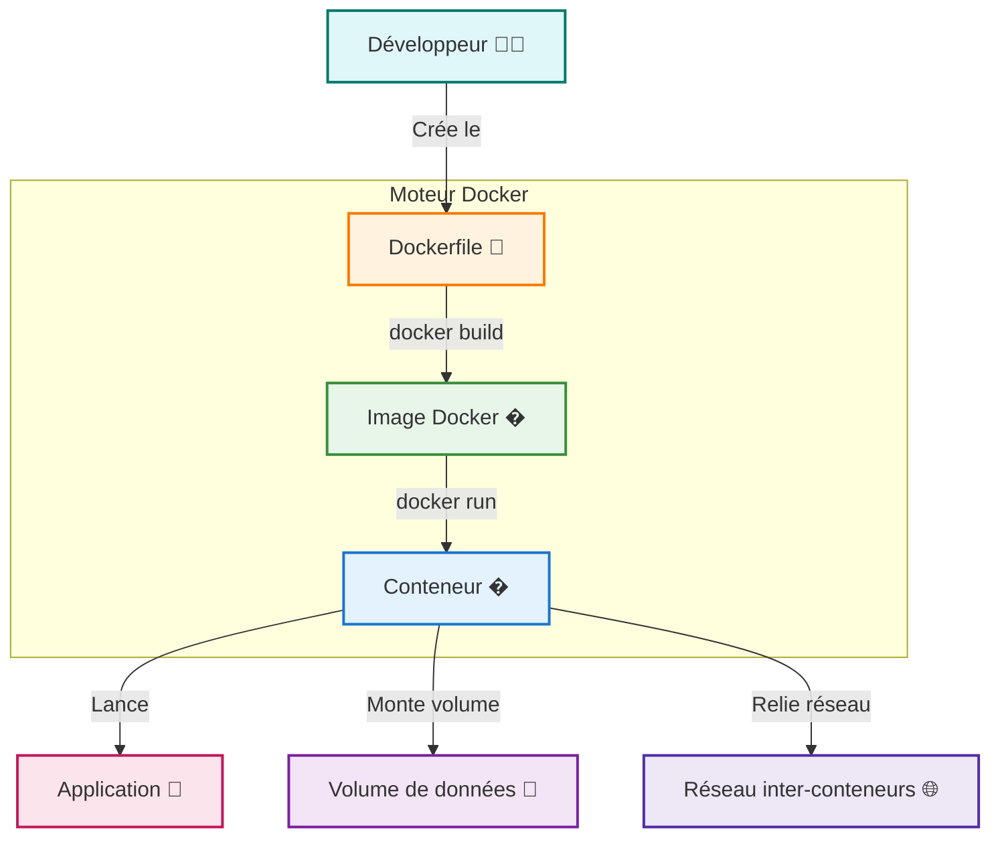

import ListOfChild from "@/components/list-of-child"

# 🐳 Docker : Conteneurisation moderne

🐳 <Term word="Docker">Docker</Term> est une technologie révolutionnaire qui facilite la gestion et le déploiement d'applications dans des environnements cohérents et reproductibles, aussi bien pour les développeurs que pour les entreprises.

## 🐳 Pour les développeurs

- **Environnements isolés et reproductibles**  

  Docker permet de créer des conteneurs 🚚 qui embarquent toutes les dépendances (bibliothèques, frameworks, configurations) dans une <Term word="image">image</Term> 📦 légère. Cela garantit que l’application s’exécute de façon identique en développement, test ou production.  
  - ✅ Fini le "ça fonctionne chez moi…"

- **Itération rapide et intégration continue**  

  Les développeurs peuvent tester différentes configurations ou outils sans impacter leur système hôte.  
  - 🔄 Idéal pour les tests automatisés et l’intégration continue, ce qui améliore la productivité.

---

## 🐳 Pour les entreprises

- **Efficacité des ressources et flexibilité**  

  Les conteneurs 🚚 Docker, très légers, permettent d’exécuter plusieurs services sur une même machine, contrairement aux machines virtuelles plus lourdes.  
  - 💡 Réduction des coûts d’infrastructure.

- **Scalabilité et <Term word="microservices">microservices</Term>**  

  Docker facilite le déploiement de microservices en isolant chaque <Term word="composant">composant</Term> pour un déploiement indépendant.  
  - 🔧 S’intègre parfaitement aux outils DevOps pour la livraison continue et des déploiements rapides.

---

**En résumé :** Docker 🐳 accélère le cycle de développement, simplifie la gestion des environnements et optimise l’utilisation des ressources. Les entreprises peuvent ainsi déployer des applications plus rapidement et à moindre coût.

---

<ListOfChild path={"/docker"} />
