import ListOfChild from "@/components/list-of-child"

# Docker

Docker est une technologie révolutionnaire qui apporte de nombreux avantages aux développeurs et aux entreprises en facilitant la gestion et le déploiement d'applications dans des environnements cohérents et reproductibles.

```mermaid
flowchart TD
    A[Développeur] -->|Crée un Dockerfile| B(Dockerfile)
    B -->|Exécute la commande<br>docker build| C[Image Docker]
    C -->|Contient des couches,<br>configuration et dépendances| D[Layers]
    C -->|Utilisée pour créer| E[Conteneur Docker]
    E -->|Exécute l'application dans un environnement isolé| F[Application]
    E -->|Peut monter des volumes pour la persistance| G[Volumes]
    E -->|Connecté via des réseaux pour la communication| H[Réseau]
    G --> I[Stockage persistant]
    H --> J[Communication entre conteneurs]
    subgraph Docker Engine
      C
      E
      G
      H
    end
```

## Pour les **développeurs**

- **Environnements isolés et reproductibles**  
  Docker permet de créer des conteneurs qui encapsulent toutes les dépendances (bibliothèques, frameworks, configurations) dans une image légère. Cela garantit que l’application s’exécute de manière identique, que ce soit en développement, en test ou en production.  
  - ✅ Résout le classique problème du "ça fonctionne chez moi…"
  
- **Itération rapide et intégration continue**  
  Grâce à Docker, les développeurs peuvent expérimenter différentes configurations ou outils sans impacter leur système hôte.  
  - 🔄 Facilite les tests automatiques et l’intégration continue, améliorant ainsi la productivité.

---

## Pour les **entreprises**

- **Efficacité des ressources et flexibilité**  
  Les conteneurs Docker, grâce à leur légèreté, permettent d’exécuter plusieurs services sur une seule machine, en contraste avec les machines virtuelles plus lourdes.  
  - 💡 Réduction significative des coûts d’infrastructure.
  
- **Scalabilité et gestion des microservices**  
  Docker simplifie le déploiement de microservices en isolant chaque composant pour un déploiement indépendant.  
  - 🔧 S’intègre parfaitement aux outils DevOps pour la livraison continue et des déploiements rapides.
  
---

**En résumé :** Docker accélère le cycle de développement en simplifiant la gestion des environnements et en optimisant l’utilisation des ressources, permettant ainsi aux entreprises de déployer des applications plus rapidement et à moindre coût.

---

<ListOfChild path={"/docker"} />
