import { FileTree } from 'nextra/components'
import { Callout } from 'nextra/components'
 

# 🧪 MongoDB-TP-TW3

## 🔗 Ressources :
- [CodeSandbox](https://codesandbox.io/) est une plateforme en ligne offrant un environnement de développement collaboratif basé sur le cloud.
  
- L'image Docker officielle de MongoDB peut être trouvée sur le [Hub Docker - MongoDB](https://hub.docker.com/_/mongo), offrant une solution prête à l'emploi pour le déploiement de bases de données MongoDB dans des conteneurs Docker.

- [Express](https://www.npmjs.com/package/express/) est un framework web minimaliste et flexible pour Node.js, permettant de créer des applications web robustes et évolutives.

- [MongoDB](https://www.npmjs.com/package/mongodb/) est un système de gestion de base de données NoSQL orienté document.

- [Body-Parser](https://www.npmjs.com/package/body-parser) est un middleware Node.js facilitant le traitement des données du corps des requêtes HTTP dans une application Express.

## 🍃 Étapes :
- Créer un devBox Node.js sur [codesandBox](https://codesandbox.io/dashboard/recent)
- Utiliser le cours pour installer mongoDB dans le codesandBox, et lancer un container docker mongo.
- Installer les dépendances (librairies), nécessaire au projet.
    ```sh npm2yarn copy
    npm i express mongodb body-parser
    ```
- Créer les fichiers de base du projet :

<FileTree>
  <FileTree.Folder name="node-mongodb-docker" defaultOpen>
    <FileTree.Folder name="src" defaultOpen>
      <FileTree.File name="index.js" />
        <FileTree.Folder name="public" defaultOpen>
        <FileTree.File name="index.html" />
        <FileTree.File name="style.css" />
        <FileTree.File name="script.js" />
        </FileTree.Folder>
  </FileTree.Folder>
    <FileTree.File name="package.json" />
  </FileTree.Folder>
</FileTree>

<Callout type="warning" emoji="⚠️">
  Il y a des erreurs dans le code que je vous fourni, principalement du fait que j'ai fait évoluer l'exercice plusieurs fois. Vous allez devoir les identifier pour faire fonctionner le project 
  
  **vous pouvez/devez travailler tous ensembles**
</Callout>
## 🍃 Création des fichiers

### 📇 public/index.html
```html filename="public/index.html" copy
<!DOCTYPE html>
<html lang="en">
<head>
  <meta charset="UTF-8">
  <meta name="viewport" content="width=device-width, initial-scale=1.0">
  <link rel="stylesheet" href="style.css">
  <title>Node.js MongoDB Docker</title>
</head>
<body>
  <h1>Hello, MongoDB!</h1>
  <div>
    <label for="dataInput">Data:</label>
    <input type="text" id="dataInput" />
    <button onclick="sendData()">Send Data</button>
  </div>
  <div id="output"></div>
  <script src="script.js"></script>
</body>
</html>
```
### 🍃 public/style.css

```css filename="public/style.css" copy
body {
  font-family: Arial, sans-serif;
  margin: 20px;
}

h1 {
  color: #333;
}

div {
  margin-top: 20px;
}

label {
  font-weight: bold;
}

input {
  margin-right: 10px;
}

button {
  cursor: pointer;
}
```
### 🍃 public/script.js

```js filename="public/script.js" copy
function sendData() {
  const dataInput = document.getElementById('dataInput');
  const outputDiv = document.getElementById('output');

  const data = dataInput.value;

  // Utilisez fetch pour envoyer des données au serveur
  fetch('/sendData', {
    method: 'POST',
    headers: {
      'Content-Type': 'application/json',
    },
    body: JSON.stringify({ data }),
  })
  .then(response => response.json())
  .then(result => {
    outputDiv.innerText = `Server Response: ${result.message}`;
  })
  .catch(error => {
    console.error('Error sending data:', error);
  });
}
```
### 📇 src/index.js
```js filename="src/index.js" copy
const express = require('express');
const { MongoClient } = require('mongodb');
const bodyParser = require('body-parser');

const app = express();
const PORT = process.env.PORT || 3000;

// URL de MongoDB sur le port 27017, le protocole est mongodb:// l'hôte est localhost utilisez les information de configuration de docker comme référence.
const mongoUrl = 'mongodb://localhost:27017';

// Utilisez bodyParser pour parser les requêtes JSON
app.use(bodyParser.json());

// Utilisez express.static pour servir les fichiers statiques
app.use(express.static("src/public"));

// Route pour envoyer des données à l'API
app.post('/addData', async (req, res) => {
  const dataContent = req.body.data;

  try {
    // Établir une connexion avec la base de données
    const client = new MongoClient(mongoUrl);
    await client.connect();

    // Sélectionne la base de données et la collection 
    const collection = client.db().collection('data');

    // Insérer une nouvelle donnée dans la collection
    await collection.insertOne({ content: dataContent });

    // Fermer la connexion
    await client.close();

    res.json({ message: 'Data added successfully' });
  } catch (error) {
    console.error('Error adding data:', error);
    res.status(500).json({ error: 'Internal Server Error' });
  }
});

// Route pour récupérer des données depuis l'API
app.get("/list", async (req, res) => {
  try {
    // Établir une connexion avec la base de données
    const client = new MongoClient(mongoUrl);
    await client.connect();

    // Sélectionner la collection
    const collection = client.db("test").collection("ma_collection");

    // Récupérer les données de la collection et les formatter en tableau JSON
    const list = await collection.find().toArray();

    // Fermer la connexion
    await client.close();

    // Renvoyer le tableau JSON à l'utilisateur
    res.json({ list });
  } catch (error) {
    console.error("Error reading data:", error);
    res.status(500).json({ error: "Internal Server Error" });
  }
});

// Route pour récupérer un document depuis l'API
app.get("/etudiant/:id", async (req, res) => {
  const { id } = req.params;
  // à vous de compléter
});

// Route pour modifier un document depuis l'API
app.post("/edit/:id", async (req, res) => {
  const { id } = req.params;
  // à vous de compléter
});

// ... (autres routes)

app.listen(PORT, () => {
  console.log(`Example app listening on port ${PORT}`)
})
```




```mermaid copy
flowchart TD
    A[Formulaire] -->|"envoi des données"| B("sendData()")
    B -->|/endpoint| C{Express}
    C -->|connu| D[MongoClient]
    C -->|inconnu| E[Error]
    D -->|Requête| F[MongoDB]
    F -->|Réponse| C{Express} 
    C -->|Retourne la réponse| A{Formulaire} 
```

## 🍃 Objectifs

Développer le projet créé en utilisant deux documents (cf: [modélisation](/mongoDB/modelisation/modelisation)) :

pet et owner pour reprendre le TP précédent, vous pourrez réutiliser un structure connu et simple, ce qui vous permettra de vous concentrer sur l'essentiel.
