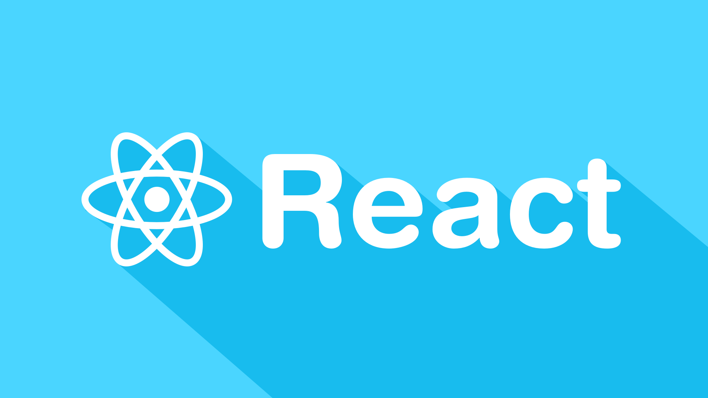

import ListOfChild from "@/components/list-of-child"

# 📘 Introduction à React
<Term word="React">React</Term> est un framework JavaScript puissant conçu pour la construction d'interfaces utilisateur interactives et performantes. Son approche déclarative et sa flexibilité en font un choix populaire parmi les développeurs pour créer des applications web modernes.

Dans ce cours, nous explorerons les concepts fondamentaux de React, notamment :

- Les composants, qui sont au cœur de la philosophie de React
- La gestion de l'état et la communication entre les composants
- Les Hooks, une fonctionnalité clé pour les composants fonctionnels
- Le routage avec React Router
- Les formulaires et leur gestion
- Le déploiement d'une application React

Nous commencerons par configurer notre environnement de développement, puis nous plongerons dans chacun de ces sujets en détail. À la fin de ce cours, vous aurez une compréhension solide de React et serez capable de construire vos propres applications web interactives.

<ListOfChild path={"/react"} />
